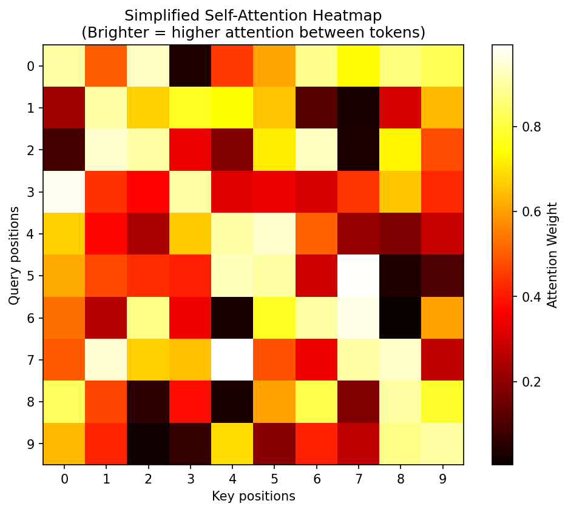
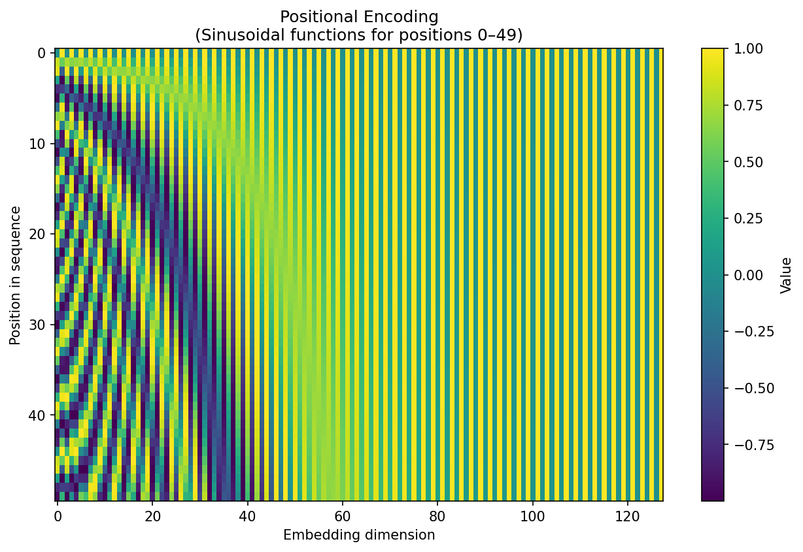

### Task 2 – transformer.md

```markdown
# Task 2 – Transformer Networks

## Description of the Transformer Architecture

The **Transformer** is a neural network architecture introduced in the 2017 paper *"Attention Is All You Need"* by Vaswani et al. It replaced recurrent layers (RNN/LSTM/GRU) with pure attention mechanisms, enabling much better parallelization and capturing of long-range dependencies.

The model consists of an **encoder** and a **decoder** stack (typically 6 layers each in the original paper).

**Encoder layer** components:
- **Multi-Head Self-Attention** — allows the model to attend to different representation subspaces simultaneously
- **Feed-forward network** (two linear layers with ReLU/GELU)
- Residual connections + Layer Normalization around both sub-layers

**Decoder layer** components:
- Masked Multi-Head Self-Attention (prevents attending to future tokens)
- Multi-Head Attention over encoder outputs
- Feed-forward network
- Residual connections + Layer Normalization

The most important mechanism is **Scaled Dot-Product Attention**:

Attention(Q, K, V) = softmax( (Q Kᵀ) / √dₖ ) V

Where Q = queries, K = keys, V = values, dₖ = dimension of keys.

**Positional Encoding** is added to input embeddings because the model contains no recurrence or convolution — it needs explicit position information. The original paper uses fixed sine/cosine functions:

PE(pos,2i)   = sin(pos / 10000^(2i/d_model))  
PE(pos,2i+1) = cos(pos / 10000^(2i/d_model))

Transformers are now the dominant architecture in NLP (BERT, GPT, T5, LLaMA), vision (ViT, Swin), audio, time series, and many other domains.

(Word count: ~310)

### Visualization of the Attention Layer Mechanism


*Example of attention weights between tokens. Brighter colors indicate stronger relationships.*

### Visualization of Positional Encoding


*Sinusoidal positional encodings added to token embeddings (first 50 positions shown).*

(You can also generate them locally with NumPy/Matplotlib if preferred.)

## Applications in Cybersecurity

Transformers are increasingly used in security tasks that involve sequential or text-like data:

- Network traffic anomaly detection (model packet sequences or NetFlow records)
- Log analysis and threat hunting (parse and classify security logs)
- Phishing and spam detection (fine-tune BERT-like models on email/URL text)
- Malware detection in source code or disassembled binaries (CodeBERT, VulBERTa)
- Automated IOC extraction and threat intelligence summarization
- User and entity behavior analytics (UEBA) from authentication/audit logs

Their ability to model long contexts and capture subtle patterns often outperforms LSTM/GRU approaches, especially on large datasets.

(Word count total: ~460)