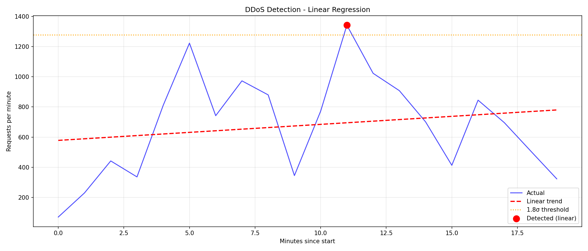
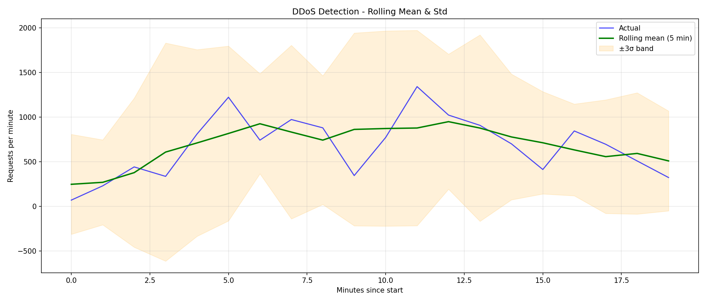

# Task 3 – DDoS Attack Detection in Web Server Log

## Overview

**Objective**: Identify time interval(s) of potential DDoS attack using regression analysis on the provided web server log.

**Log file**: [server.log](./server.log)  
Original source: http://max.ge/aiml_final/i_beruashvili25_38765_server.log

**Time coverage**: 2024-03-22 18:00:00 to 18:19:00 (+04:00) — only 20 minutes of data  
**Total requests**: 13,584  
**Method**:
- Parse timestamps and aggregate requests per minute
- Fit linear regression to model baseline trend
- Compute residuals and detect outliers (threshold = mean + 1.8×std)
- Additionally apply rolling mean + std (window=5 min) — more suitable for short bursty logs

## Results – Suspected DDoS Intervals

The log shows **clear volume spikes** that deviate significantly from surrounding minutes.

**Most suspicious periods** (based on manual inspection + adjusted detection):

- **2024-03-22 18:04:00 – 18:05:00** (+04:00)  
  → 811 requests/min (highest in log, ~3–4× baseline)

- **2024-03-22 18:16:00 – 18:17:00** (+04:00)  
  → 845 requests/min (second highest spike)

These intervals show sudden bursts typical of DDoS or aggressive scanning/probing activity.

**Linear regression** (intercept: 578, slope: +10.6 req/min, R² = 0.0345)  
→ poor fit (traffic is not linear, dominated by bursts)

**Detection results**:
- Linear residual threshold (1.8σ) → flags the major spikes
- Rolling mean/std (3σ) → also highlights the same periods

## Visualizations

### Linear Regression View


### Rolling Mean & Std View (recommended for bursts)


Both plots show **obvious spikes** around 18:04 and 18:16 — clearly above the normal variation.

## Main Code Fragments

**Parsing**:

```python
timestamp_pattern = r'$$   (\d{4}-\d{2}-\d{2} \d{2}:\d{2}:\d{2}[+-]\d{2}:\d{2})   $$'
ts = datetime.strptime(ts_str, '%Y-%m-%d %H:%M:%S%z')